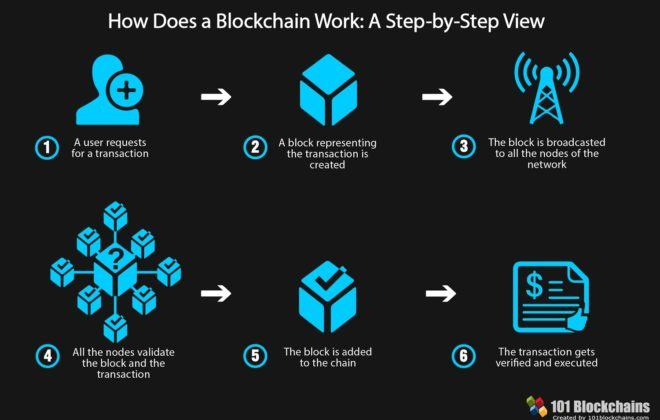

## BLOCKCHAIN BASICS 

 
	

A blockchain, originally block chain, is a growing list of records, called blocks, that are linked using cryptography. 

Each block contains a cryptographic hash of the previous block, a timestamp, and transaction data. By design, a blockchain is resistant to modification of the data. 

